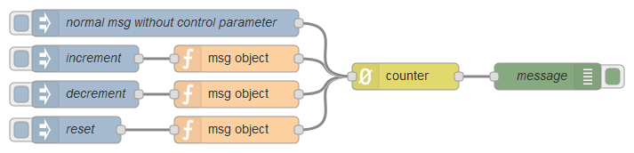
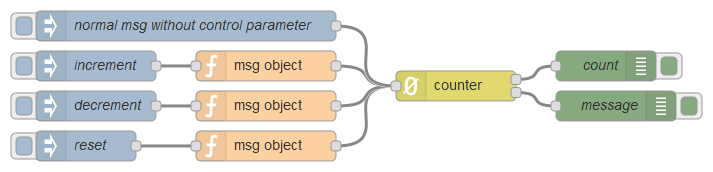

node-red-contrib-counter
========================

[](http://github.com/eisbehr-/node-red-counter)
[](http://www.npmjs.org/package/node-red-contrib-counter)
[](https://david-dm.org/eisbehr-/node-red-counter)

A <a href="http://nodered.org" target="_new">Node-RED</a> node to create a counter with messages.

---

## Table of Contents
* [Install](#install)
* [Usage](#usage)
  * [Configuration](#configuration)
  * [Output](#output)
  * [Control](#control)
* [Example Flows](#example-flows)
* [Bugs / Feature request](#bugs--feature-request)
* [License](#license)
* [Donation](#donation)

---

## Install

Run the following command in your Node-RED user directory - typically `~/.node-red`:

```
npm install node-red-contrib-counter
```


## Usage

By default the counter will be incremented for every inbound message and append the current count to `msg.count`.


### Configuration

- `Initial Count`: The initial count can be set in the configuration. By default it will be `zero` at start.
- `Default Step`: Default amount that will be incremented or decremented on every incoming message.
- `Mode`: Determine if count value should be incremented or decremented on every incoming message.
- `Outputs`: Selects the output format of the counter. _For more info read below._


### Output

There are two output options for the counter value:

- `single`: The actual count will be appended to <code>msg.count</code> of the original `msg`.
- `split`: The node will become two outputs, first will return the count as `msg.payload` and the second returns the untouched original `msg`.


### Control

It's possible to control the counter with incoming `msg` properties:

- `msg.increment`: counter will be incremented by the given value.
- `msg.decrement`: counter will be decremented by the given value.
- `msg.reset`: resets the counter to it's initial count, or to the given value, when it's a number.


## Example Flows

Simple example showing how to use the counter and it's output.



```JSON
[{"id":"25b6280d.1ecf6","type":"inject","z":"327d23e5.bb5924","name":"decrement","topic":"","payload":"","payloadType":"date","repeat":"","crontab":"","once":false,"x":380,"y":200,"wires":[["8a41c1.6006b64"]]},{"id":"285e0e19.b9680a","type":"inject","z":"327d23e5.bb5924","name":"increment","topic":"","payload":"","payloadType":"date","repeat":"","crontab":"","once":false,"x":380,"y":160,"wires":[["ce8d952f.18666"]]},{"id":"fda0a334.bc9588","type":"inject","z":"327d23e5.bb5924","name":"reset","topic":"","payload":"","payloadType":"date","repeat":"","crontab":"","once":false,"x":370,"y":240,"wires":[["17cce981.975686"]]},{"id":"ce8d952f.18666","type":"function","z":"327d23e5.bb5924","name":"msg object","func":"msg.increment = 2;\nreturn msg;","outputs":1,"noerr":0,"x":550,"y":160,"wires":[["ac65bf94.6e609"]]},{"id":"17cce981.975686","type":"function","z":"327d23e5.bb5924","name":"msg object","func":"msg.reset = true;\nreturn msg;","outputs":1,"noerr":0,"x":550,"y":240,"wires":[["ac65bf94.6e609"]]},{"id":"8a41c1.6006b64","type":"function","z":"327d23e5.bb5924","name":"msg object","func":"msg.decrement = 1;\nreturn msg;","outputs":1,"noerr":0,"x":550,"y":200,"wires":[["ac65bf94.6e609"]]},{"id":"ac65bf94.6e609","type":"counter","z":"327d23e5.bb5924","name":"","init":"0","outputs":"1","x":740,"y":180,"wires":[["988afc3c.a08f98"]]},{"id":"370626a8.22216a","type":"inject","z":"327d23e5.bb5924","name":"normal msg without control parameter","topic":"","payload":"","payloadType":"date","repeat":"","crontab":"","once":false,"x":470,"y":120,"wires":[["ac65bf94.6e609"]]},{"id":"988afc3c.a08f98","type":"debug","z":"327d23e5.bb5924","name":"message","active":true,"console":"false","complete":"true","x":900,"y":180,"wires":[]}]
```



```JSON
[{"id":"4f41c5a1.85426c","type":"inject","z":"327d23e5.bb5924","name":"decrement","topic":"","payload":"","payloadType":"date","repeat":"","crontab":"","once":false,"x":380,"y":420,"wires":[["e9085587.2d19c"]]},{"id":"afb267a8.63739","type":"inject","z":"327d23e5.bb5924","name":"increment","topic":"","payload":"","payloadType":"date","repeat":"","crontab":"","once":false,"x":380,"y":380,"wires":[["4a35e3c7.3dbd0c"]]},{"id":"f066adf1.21ba","type":"inject","z":"327d23e5.bb5924","name":"reset","topic":"","payload":"","payloadType":"date","repeat":"","crontab":"","once":false,"x":370,"y":460,"wires":[["523f8e05.d5537"]]},{"id":"4a35e3c7.3dbd0c","type":"function","z":"327d23e5.bb5924","name":"msg object","func":"msg.increment = 2;\nreturn msg;","outputs":1,"noerr":0,"x":550,"y":380,"wires":[["f33ad4bd.777a5"]]},{"id":"523f8e05.d5537","type":"function","z":"327d23e5.bb5924","name":"msg object","func":"msg.reset = true;\nreturn msg;","outputs":1,"noerr":0,"x":550,"y":460,"wires":[["f33ad4bd.777a5"]]},{"id":"e9085587.2d19c","type":"function","z":"327d23e5.bb5924","name":"msg object","func":"msg.decrement = 1;\nreturn msg;","outputs":1,"noerr":0,"x":550,"y":420,"wires":[["f33ad4bd.777a5"]]},{"id":"9b40b088.73732","type":"debug","z":"327d23e5.bb5924","name":"count","active":true,"console":"false","complete":"true","x":890,"y":380,"wires":[]},{"id":"f33ad4bd.777a5","type":"counter","z":"327d23e5.bb5924","name":"","init":"0","outputs":"2","x":740,"y":400,"wires":[["9b40b088.73732"],["876cc69d.d4b438"]]},{"id":"99b73d63.9fdb","type":"inject","z":"327d23e5.bb5924","name":"normal msg without control parameter","topic":"","payload":"","payloadType":"date","repeat":"","crontab":"","once":false,"x":470,"y":340,"wires":[["f33ad4bd.777a5"]]},{"id":"876cc69d.d4b438","type":"debug","z":"327d23e5.bb5924","name":"message","active":true,"console":"false","complete":"true","x":900,"y":420,"wires":[]}]
```


## Bugs / Feature request
Please [report](http://github.com/eisbehr-/node-red-counter/issues) bugs and feel free to [ask](http://github.com/eisbehr-/node-red-counter/issues) for new features directly on GitHub.


## License
This project is licensed under [Apache 2.0](http://www.apache.org/licenses/LICENSE-2.0) license.


## Donation
_You like to support me?_  
_You appreciate my work?_  
_You use it in commercial projects?_  
  
Feel free to make a little [donation](https://www.paypal.com/cgi-bin/webscr?cmd=_s-xclick&hosted_button_id=FFL6VQJCUZMXC)! :wink: